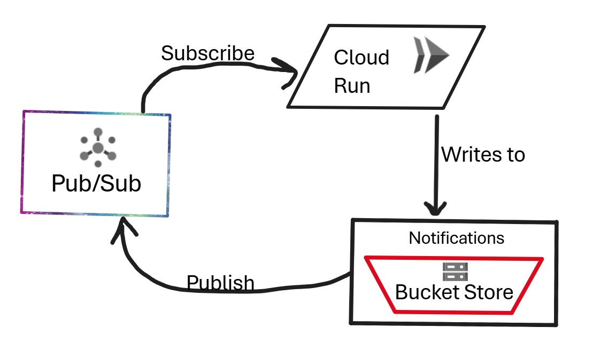

# YouTube Clone using GCP

## Uploading & processing the videos

**GCP orchestrates the workflow: from when the user uploads a video, through compressing it using functions, to storing it in a bucket, and seamlessly delivering it back to the user after completion.**

**This was merely a concise summary of the process shown in the image below, but here is the complete breakdown for further clarity:**

1. User clicks the upload button on the website
2. It triggers a Cloud Run function that takes the video and writes it to bucket store
3. After the bucket store receives the video, it immediately publishes a notification to the Pub/Sub model
4. Once the notification for a new upload arrives, it runs a Cloud Run function to process the raw video
5. Cloud Run function uses ffmpeg to compress the raw video into a polished format
6. The function writes the file to the bucket store

